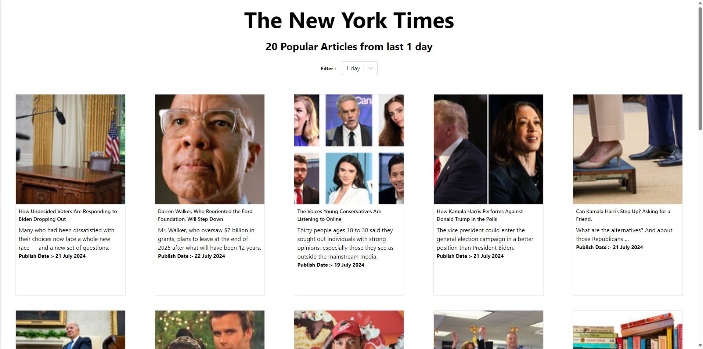
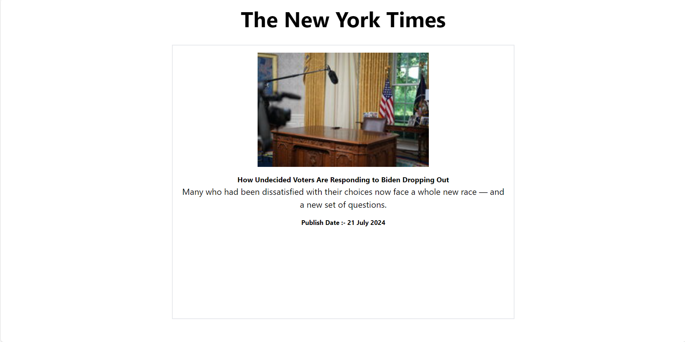

# NY Times
NY times application showing popular articles and details of article, based upon selected days.

Please refer below screenshots - 

Landing page

Article detail page 

## Teachnical stack 
 - HTML
 - Tailwind CSS
 - React
 - Typescript
 - React Testing Library
 - Cypress

## Version Used
 - node - v22.2.0
 - npm - 10.7.0
 - react - 18.3.1

## Scripts

    1. npm run install (Install packages)

To install all the project related packages from package.json. It will create a yarn.lock 
file in you project 

    2. npm run start (Start the project)

 Runs the app in the development mode.\
 Open [http://localhost:3000](http://localhost:3000) to view it in your browser.

    3. npm run test (Unit Testing)

You can find the coverage report in coverage package coverage/icov-report/index.html

    4. npm run build ( building the project)
 
Builds the app for production to the `build` folder.\
It correctly bundles React in production mode and optimizes the build for the best performance.

The build is minified and the filenames include the hashes.\
Your app is ready to be deployed!

## E2E Testing

1. npm i -D cypress 
Above command will add cypress into your code

2. npx cypress open  (e2e Testing using cypress)
This script will open cypress where need to configure some steps to add it into your code.
In that window only it will executes written test cases

